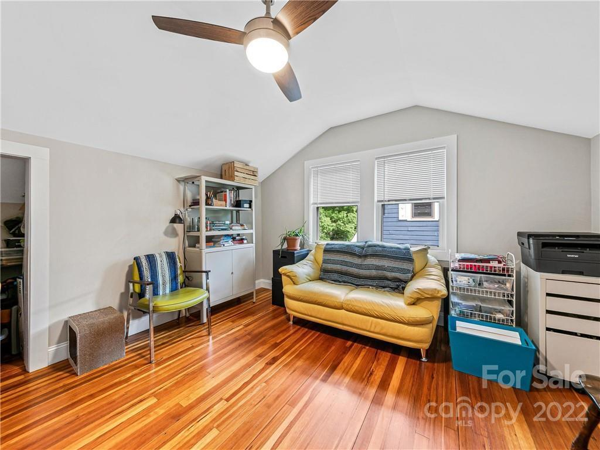

# 201 Brucemont Circle, Asheville, NC 28806

| **Year Build** | **Style** | **House Size** | Bedrooms | Bathrooms| **Lot Size** |
| --- | --- | --- | --- | --- | --- |
| 1919 | Bungalow | 2,140 sq ft | 5 | 3 | 6,098 sq ft | 

**Links**: [Google Maps](https://www.google.com/maps/place/201+Brucemont+Cir,+Asheville,+NC+28806/@35.5813416,-82.5928407,17z/data=!4m5!3m4!1s0x88598c9309da5ddd:0x6262df168dd5752!8m2!3d35.5812797!4d-82.5906962) | [Virtual Tour](https://unbranded.youriguide.com/201_brucemont_cir_asheville_nc/) | [Floor Plan](./floorplan.pdf)

